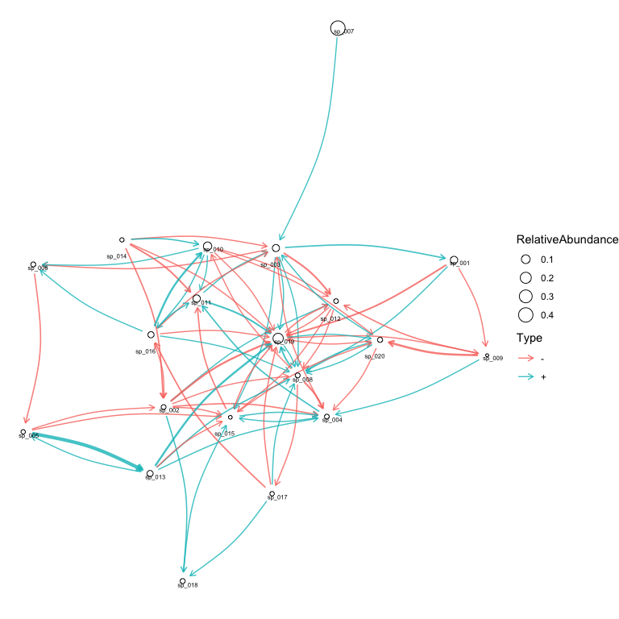
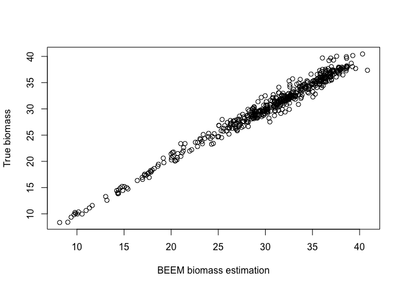
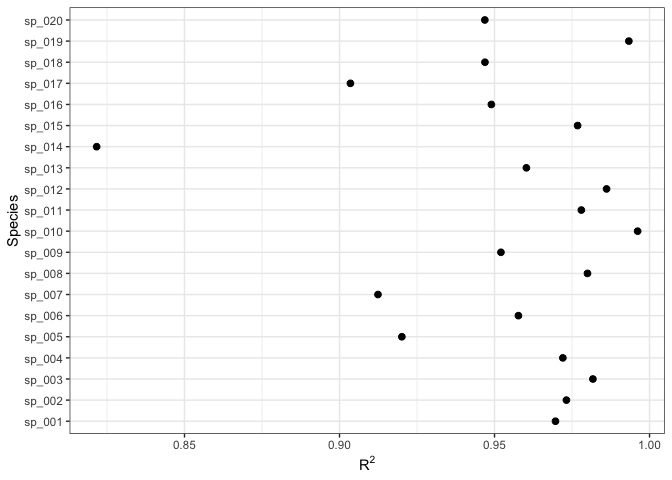

# BEEM-Static

  - Authors: Chenhao Li, Niranjan Nagarajan

## Description


BEEM-static is an R package for learning **directed microbial
interactions** from cross-sectional microbiome profiling data based on
the generalized Lotka-Volterra model (gLVM). Extending the core idea of
the original BEEM algorithm for longitudinal data
([Reference](https://microbiomejournal.biomedcentral.com/articles/10.1186/s40168-019-0729-z),
[Source code](https://github.com/CSB5/BEEM)), BEEM-static directly works
with **relative abundances** to jointly estimate **total biomass** and
**gLVM parameters**, thus eliminating the need for experimentally
quantifying absolute abundances. BEEM-static identifies microbiomes that
are not at equilibrium states and automatically excludes such samples
from the analysis. The package also provides the user with a collection
of utility functions for visualizing and diagnosing the fitted model.

**Note**: This package is under active development. Please record the
commit ID for reproducibility.

## Installation

``` r
devtools::install_github('lch14forever/BEEM-static')
```

## Example usage

### Dataset

The demo dataset is a simulated community of 20 species and 500 samples.
All of the samples are at the equilibrium states (generated by
numerically integrating the gLVM until convergence) and each sample
contains 70% of all the species randomly (each species has a 70% habitat
preference).

``` r
library(beemStatic)
data("beemDemo")
attach(beemDemo)

## Use `?beemDemo` to see the help of the fields in this dataset
```

### Analysis with BEEM-static

BEEM-static is run by calling the `func.EM`
function.

``` r
res <- func.EM(dat.w.noise, ncpu=4, scaling=median(biomass.true), max.iter=200, epsilon = 1e-4)
```

#### Visualizing inferred interaction network

We provide a function `showInteraction` to plot the interaction network
inferred by BEEM-static (based on the
[ggraph](https://github.com/thomasp85/ggraph) package).

``` r
showInteraction(res, dat.w.noise)
```

    ## Warning: package 'ggplot2' was built under R version 3.5.2

<!-- -->

#### Estimating biomass

BEEM-static also estimates the biomass for each sample (retrieved by the
`beem2biomass` function). Here we can compare the estimated biomass with
the true biomass on this simulated
dataset.

``` r
plot(beem2biomass(res), biomass.true, xlab='BEEM biomass estimation', ylab='True biomass')
```

<!-- -->

#### Investigating model fit

We provide a function `diagnoseFit` to plot the [coefficient of
determination](https://en.wikipedia.org/wiki/Coefficient_of_determination)
(R<sup>2</sup>) for each species. A high R<sup>2</sup> (close to 1)
value indicates that the variation in the data is well explained by the
model.

``` r
diagnoseFit(res, dat.w.noise, annotate = FALSE)
```

<!-- -->

### Comparing BEEM-static with correlation based methods

We now run two popular methods for inferring microbial interactions on
our simulated data. Both methods try to infer a correlation matrix as a
proxy for the interaction matrix.

1.  Using an naive Spearman’s correlation method

<!-- end list -->

``` r
spearman <- cor(t(dat.w.noise), method='spearman')
```

2.  Using [SPIEC-EASI](https://github.com/zdk123/SpiecEasi)

<!-- end list -->

``` r
## devtools::install_github("zdk123/SpiecEasi")
library(SpiecEasi)
```

    ## 
    ## Attaching package: 'SpiecEasi'

    ## The following object is masked from 'package:igraph':
    ## 
    ##     make_graph

``` r
se <- spiec.easi(t(dat.w.noise), method='mb')
```

    ## Applying data transformations...

    ## Selecting model with pulsar using stars...

    ## Fitting final estimate with mb...

    ## done

``` r
se.stab <- as.matrix(getOptMerge(se))
```

3.  Using BEEM-static

<!-- end list -->

``` r
est <- beem2param(res)
```

We implement a function `auc.b` for ploting the receiver operating
characteristic (ROC) curve with computed area under the curve (AUC). We
compare the ROC curves of the above three methods. We use `inference`
function provided in the pacakge to estimate confidence values
(t-statistics) that can be used to rank the predictions.

``` r
par(mfrow=c(1,3))
auc.b(spearman, scaled.params$b.truth, is.association = TRUE, main='Spearman correlation', print.auc.cex=2)
auc.b(se.stab, scaled.params$b.truth, is.association = TRUE, main='SPIEC-EASI', print.auc.cex=2)
auc.b(inference(dat.w.noise, res), scaled.params$b.truth, main='BEEM-static', print.auc.cex=2)
```

<!-- -->

## Citation

A manuscript for BEEM-static is in preparation and please contact us
([Li Chenhao](mailto:lich@gis.a-star.edu.sg) or [Niranjan
Nagarajan](mailto:nagarajann@gis.a-star.edu.sg)) if you are interested
in using it. Alternatively, you can also cite our manuscript on BEEM:

  - C Li, et al. (2018) An expectation-maximization-like algorithm
    enables accurate ecological modeling using longitudinal metagenome
    sequencing data.
    [Microbiome](https://microbiomejournal.biomedcentral.com/articles/10.1186/s40168-019-0729-z)
